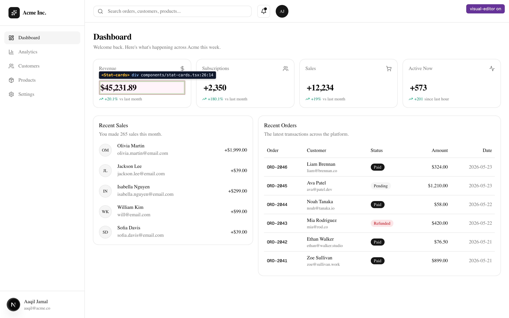
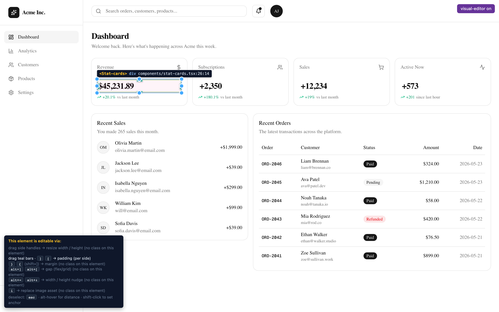
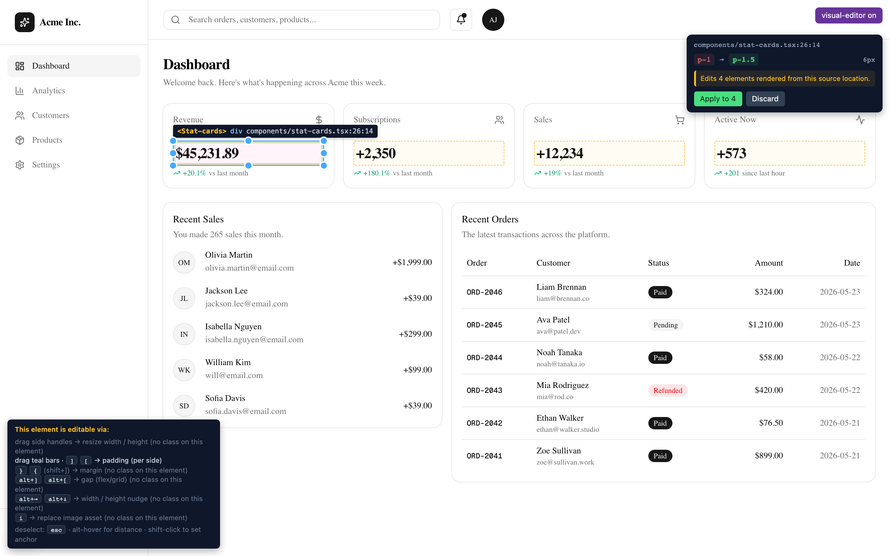
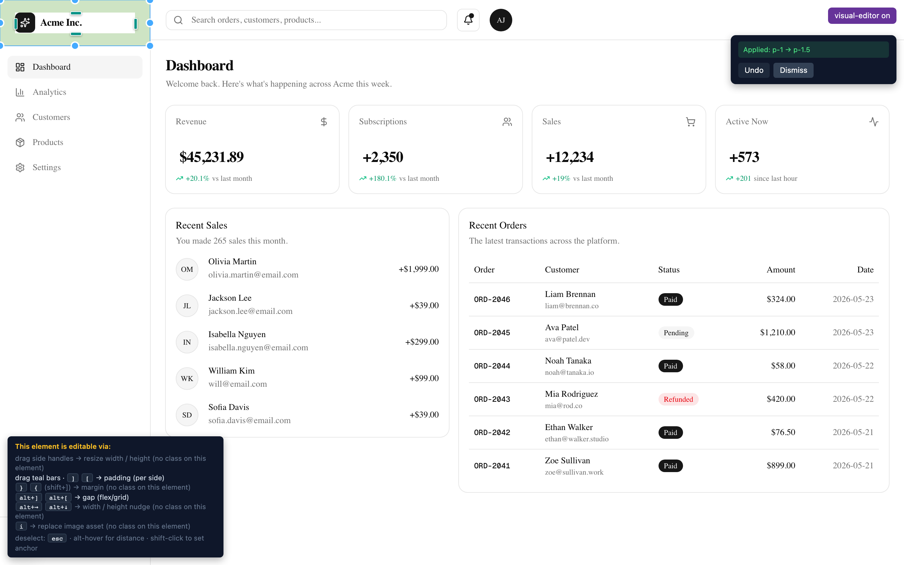

# visual-editor

> **Visual gestures on your `next dev` page → deterministic Tailwind / CSS Modules / styled-components edits in your source files.** With Claude Code as reviewer-committer (not interpreter) over stdio MCP.

<table>
  <tr>
    <td></td>
    <td></td>
  </tr>
  <tr>
    <td></td>
    <td></td>
  </tr>
</table>

## Why this exists

Most visual editors prompt an LLM to guess the edit. visual-editor doesn't guess.
Every gesture maps to a deterministic AST transformation; if a write isn't
provably safe, it refuses loudly with a structured reason. The LLM in the loop
is for review and batching, not interpretation.

## Quick start

```bash
npm install --save-dev @aaqiljamal/visual-editor-next
npx visual-editor-init
```

Then add **two lines** to `app/layout.tsx`:

```tsx
import { VisualEditOverlay } from "@aaqiljamal/visual-editor-next";

// inside <body>:
{process.env.NODE_ENV === "development" && <VisualEditOverlay />}
```

Run `npm run dev`, hover any element, click, drag. Full options (including
the standalone-server flow for Vite/Remix and the Claude Code MCP wiring):
see [INSTALL.md](./INSTALL.md).

## What works

| Gesture | Outcome |
|---|---|
| Hover | Pink outline + source badge + box-model bands |
| Click | 8 drag handles + 4 inner padding handles |
| Drag side handle | Tailwind-scale snap → pending panel |
| `[` / `]` | Padding step down/up |
| `{` / `}` | Margin step down/up |
| `Alt+ArrowKey` | Width / Height step |
| Click `` + `i` | Asset picker (lists everything in `public/`) |
| Element wrapped in `cn()`/`clsx()`/`twMerge()` | Mutation inside the call — with static safety analysis |
| Element using `{styles.x}` | CSS Module edit on the `.module.css` source |
| Styled component | Edit on the tagged template's CSS text |
| Apply | Source file written → Fast Refresh repaints |
| Undo | Inline banner or in the history panel |
| Shift-click + Alt-hover | Figma-style distance label |

## What it refuses (and why)

Loud refusals over silent best-effort. Every refusal carries a structured reason:

| Reason | What it means |
|---|---|
| `dynamic-uncertain-arg` | `cn("p-4", someVar)` — can't prove the new token sticks |
| `dynamic-conflict` | `cn("p-4", "p-8")` — tailwind-merge would drop the new token |
| `composes-chain` | CSS Module uses `composes:` — would leak through; edit by hand |
| `styled-with-interpolation` | Styled has `${…}` — only fully-static templates supported |
| `cross-file-styled-not-supported` | Styled definition lives in another file |
| `path-outside-workspace` | Tried to write outside the project root |
| `token-not-found` | The file changed externally — re-stage |

## Verified on

- Next.js **16.2.6** (App Router)
- React **19.2.4**
- Tailwind **v4** (`@tailwindcss/postcss`)
- styled-components **6.x**

Older Next/React may work but there's no automated coverage yet. File an issue
if you hit something.

## The packages

| Package | What it is |
|---|---|
| [`@aaqiljamal/visual-editor-next`](./packages/next) | Meta-package for Next.js — install this one |
| [`@aaqiljamal/visual-editor-runtime`](./packages/runtime) | The browser overlay (Preact, closed Shadow DOM) |
| [`@aaqiljamal/visual-editor-babel-plugin`](./packages/babel-plugin) | Stamps `data-oid` and related attributes on JSX at build time |
| [`@aaqiljamal/visual-editor-server`](./packages/server) | The Node-side AST mutator (Tailwind / CSS Modules / styled-components) |
| [`@aaqiljamal/visual-editor-mcp`](./packages/mcp) | stdio MCP server for Claude Code integration |

## Claude Code integration

```bash
npm install --save-dev @aaqiljamal/visual-editor-mcp

claude mcp add visual-editor \
  --env VISUAL_EDITOR_WORKSPACE_ROOT="$(pwd)" \
  --env VISUAL_EDITOR_SERVER_URL="http://localhost:3000/api/visual-editor" \
  -- npx visual-editor-mcp
```

Inside Claude Code, `/mcp` shows 6 tools (`get_selected_element`, `propose_change`,
`apply_change`, `revert_change`, `apply_css_property`, `apply_styled_property`).

## Roadmap

- **v0.2** (current) — Tailwind, CSS Modules, styled-components, image swaps, undo, history, monorepo support
- **v0.3** — Design tokens panel, CVA variant authoring, git checkpoint chain
- **Out of scope** — production runtime, multi-cursor, instance-level edits, becoming Figma

Full deferral logic in [V02_PLAN.md](./V02_PLAN.md), principles in [PROJECT_CONTEXT.md](./PROJECT_CONTEXT.md).

## Demo

The screenshots above were captured against a shadcn/ui dashboard at
[`examples/shadcn-demo/`](./examples/shadcn-demo). It uses the published
packages from npm (same install your friend would do), with one extra Babel
plugin option for monorepo path resolution. Boot it:

```bash
cd examples/shadcn-demo
npm install
npm run dev
# open http://localhost:3000
```

Recreate the screenshots with `node scripts/capture-demo-screenshots.mjs`.

## Status

- **129/129** server tests passing
- **7/7** MCP smoke tests passing
- End-to-end verified on Next 16 / React 19 / Tailwind v4 — both a barebones
  spike (`spikes/example-app/`) for edge-case coverage and a shadcn/ui
  dashboard (`examples/shadcn-demo/`) for real-world usage
- Published packages installed and working from a fresh `create-next-app`

## License

MIT — see [LICENSE](./LICENSE).
