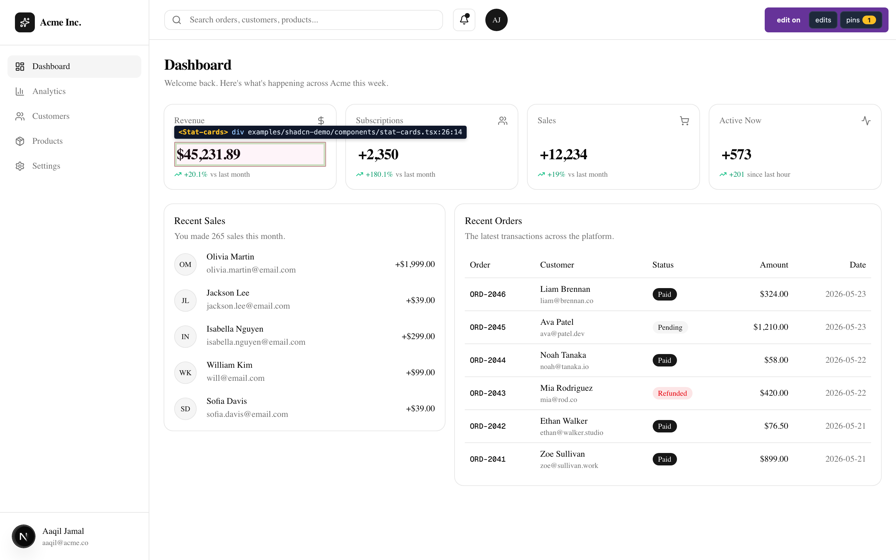
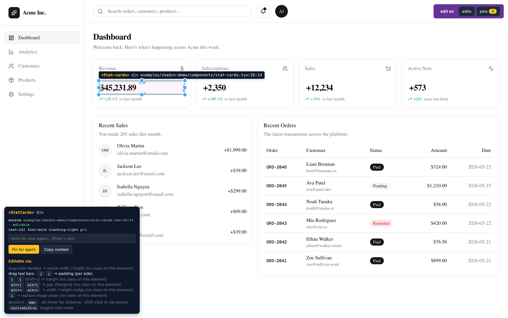
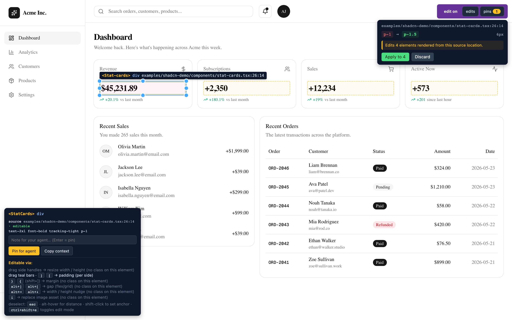
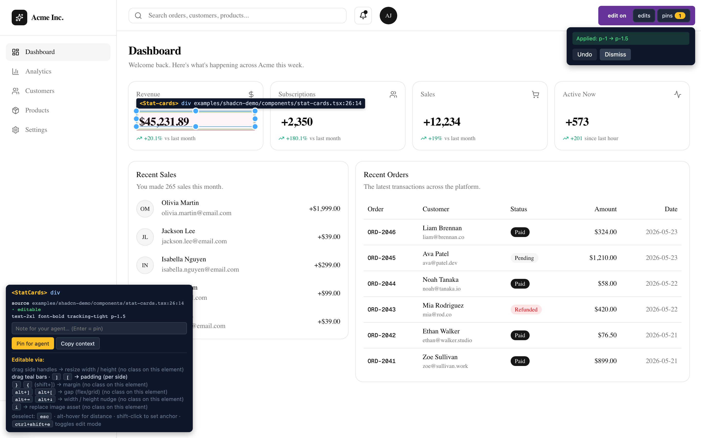

# visual-editor

> **Point at an element in your running app. Edit it visually, or hand it to your coding agent with the exact source location attached.** Deterministic Tailwind / CSS Modules / styled-components edits from gestures; Claude Code (or Cursor, Codex, …) as reviewer, not interpreter.

<table>
  <tr>
    <td></td>
    <td></td>
  </tr>
  <tr>
    <td></td>
    <td></td>
  </tr>
</table>

## Why this exists

"Make the padding on the login button a bit bigger" is a lossy way to describe a visual
change: which button, which padding, how much, and in which file? Agents guess, and guess
wrong. visual-editor removes the guessing:

- **Every DOM node knows its source** — a build-time stamp maps it to `file:line:col`, both the
  element inside the component *and* the place the component was used.
- **Gestures become exact edits** — drag, nudge, pick an asset → one class token or one CSS
  declaration changes in your source. If the write can't be proven safe, it refuses loudly with a
  structured reason instead of doing its best.
- **Your agent gets facts, not prose** — selection, component name, which location owns the
  token, a source snippet, computed styles, instance count, and your note. Through MCP, or as a
  block you paste anywhere.

## Quick start — Next.js (App Router, 15.3+, verified on 16.4)

```bash
npm install --save-dev @aaqiljamal/visual-editor-next
npx visual-editor-init
npm run dev
```

The init script writes a one-line Route Handler, wraps `next.config` in `withVisualEditor()`, and
adds `.visual-editor/` to `.gitignore`. On Next ≥ 16.3 the overlay auto-mounts; nothing else to
touch. No Babel config — SWC and Turbopack stay on. Details and the manual steps:
[INSTALL.md](./INSTALL.md).

## Quick start — Vite + React

```bash
npm install --save-dev @aaqiljamal/visual-editor-vite
```

```ts
// vite.config.ts
import react from "@vitejs/plugin-react";
import { visualEditor } from "@aaqiljamal/visual-editor-vite";

export default defineConfig({ plugins: [react(), visualEditor()] });
```

That's it: the plugin stamps JSX before React compiles it, serves the writer API on the dev
server, and injects the overlay. React Router v7 (framework mode), TanStack Start and Astro+React
use the same plugin.

## How you share context with your agent

Three ways, from zero-setup to fully wired:

1. **Copy context** — select an element, type a note, click *Copy context*. Paste into any agent:

   ```
   [visual-editor] <button> in Button — components/ui/button.tsx:30:4
   used at: app/page.tsx:42:8 (in Page)
   className @ call site: p-4 bg-red-500
   className @ host: cn(… +1 dynamic) — not editable: className is cn(...) with 1 non-static argument(s)
   renders 3 instances · 96×36px · padding 16px · font-size 14px
   note: too loud, make it secondary
   ```

2. **Pins + `/visual-editor`** — walk the page, pin elements with notes, then run one command in
   Claude Code. The agent gets every pin with source refs, editability and snippets; it can flash
   an outline in your browser to ask *"this one?"*, and marks pins green when done.

3. **Just gestures** — drag or nudge, hit Apply. No language anywhere. The agent only reviews the
   diff and commits.

## What works

| Gesture | Outcome |
|---|---|
| Hover | Outline + `<Component> tag file:line:col` badge + box-model bands |
| Click | Selection: 8 resize handles, 4 inner padding handles, selection panel |
| Drag side handle / `Alt+Arrow` | Width / height → snapped to your Tailwind scale |
| `[` `]` · `{` `}` · `Alt+[` `Alt+]` | Padding · margin · gap, one scale step |
| Drag teal padding bars | Per-side padding (`p-4` → `p-4 pt-6`) |
| `i` on an `` | Asset picker over `public/` |
| Element from a component that spreads props (shadcn/ui, Radix, `next/image`) | Edits the **call site** when it owns the token, the component otherwise |
| `cn()` / `clsx()` / `twMerge()` with static args | Mutation inside the call, checked with tailwind-merge |
| `className={styles.x}` | CSS Module declaration edit |
| Static `styled.div\`…\`` | styled-components declaration edit |
| Apply | Source written → Fast Refresh / HMR repaints; Undo in-panel or in history |
| Shift-click + Alt-hover | Figma-style distance measurement |
| Note + Enter | Pin for your agent; numbered marker on the page |
| `Ctrl+Shift+E` / toolbar | Toggle edit mode (clicks select vs. the app behaves normally) |

## What it refuses (and why)

| Reason | Meaning |
|---|---|
| `dynamic-uncertain-arg` | `cn("p-4", someVar)` — a runtime arg could override the token |
| `dynamic-conflict` | `cn("p-4", "p-8")` — tailwind-merge would drop your new token |
| `no-classname-attribute` | Props are spread in; edit the call site instead (the overlay already picked it) |
| `composes-chain` | CSS Module uses `composes:` — would leak into other rules |
| `styled-with-interpolation` | Styled template has `${…}` |
| `token-not-found` (409) | The file changed since you staged the edit |
| `path-outside-workspace` / `cross-site-request` | Safety checks |

## Works with

| | Status |
|---|---|
| Next.js App Router, Turbopack or webpack | ✅ verified (16.4) — auto-mount needs ≥ 16.3 |
| Vite + React (`@vitejs/plugin-react`, Babel or oxc) | ✅ verified (Vite 8) |
| React Router v7 framework mode, TanStack Start, Astro + React | 🟡 same Vite plugin, untested |
| Next.js Pages Router | 🟡 hover/select works; writes need a `pages/api` adapter (planned) |
| Babel pipelines (CRA-era, custom) | ✅ `@aaqiljamal/visual-editor-babel-plugin` + standalone server |
| Tailwind v3/v4 class tokens, CSS Modules, static styled-components / Emotion `styled.x` | ✅ |
| Inline `style={{}}`, global CSS, CVA variants, Panda/StyleX | ❌ not yet (see [docs/AUDIT-2026-10.md](./docs/AUDIT-2026-10.md)) |

## Claude Code (and other MCP agents)

```bash
npm install --save-dev @aaqiljamal/visual-editor-mcp

claude mcp add visual-editor \
  --env VISUAL_EDITOR_SERVER_URL="http://localhost:3000/api/visual-editor" \
  -- npx visual-editor-mcp
```

Eight tools: `get_selected_element` (selection + pins + recent edits, with source refs and
snippets), `propose_change`, `apply_change`, `revert_change`, `apply_css_property`,
`apply_styled_property`, `highlight_element`, `resolve_pin`. `npx visual-editor-init --claude`
drops a `/visual-editor` command into `.claude/commands/`. Cursor / Codex / Windsurf: same stdio
server, see [INSTALL.md](./INSTALL.md#other-agents).

## Packages

| Package | What it is |
|---|---|
| [`@aaqiljamal/visual-editor-next`](./packages/next) | Next.js: `withVisualEditor()` config wrapper, loader, Route Handler, init script |
| [`@aaqiljamal/visual-editor-vite`](./packages/vite) | Vite plugin: transform + dev middleware + overlay injection |
| [`@aaqiljamal/visual-editor-runtime`](./packages/runtime) | The browser overlay (closed Shadow DOM, framework-free `mountVisualEditor()`) |
| [`@aaqiljamal/visual-editor-server`](./packages/server) | Stamper (`/transform`), AST mutators, transport-agnostic API core, standalone CLI |
| [`@aaqiljamal/visual-editor-mcp`](./packages/mcp) | stdio MCP server |
| [`@aaqiljamal/visual-editor-babel-plugin`](./packages/babel-plugin) | Same stamps for pipelines that already run Babel |

## Demos

- [`examples/shadcn-demo`](./examples/shadcn-demo) — a shadcn/ui dashboard on Next.js (the screenshots above).
- [`examples/vite-demo`](./examples/vite-demo) — Vite + React + Tailwind with a prop-spreading `Card`.
- [`spikes/example-app`](./spikes/example-app) — edge-case fixtures: Server Components, `cn()`, CSS Modules, styled-components, images.

## Status

- Server 138/138 tests (incl. stamper ↔ Babel-plugin parity), MCP 10/10, all packages typecheck.
- End-to-end verified in a real browser on Next 16.4 / React 19.3 / Tailwind 4.3 and Vite 8.
- [docs/AUDIT-2026-10.md](./docs/AUDIT-2026-10.md) lists what changed in v0.3 and what's next;
  principles in [PROJECT_CONTEXT.md](./PROJECT_CONTEXT.md).

## License

MIT — see [LICENSE](./LICENSE).
